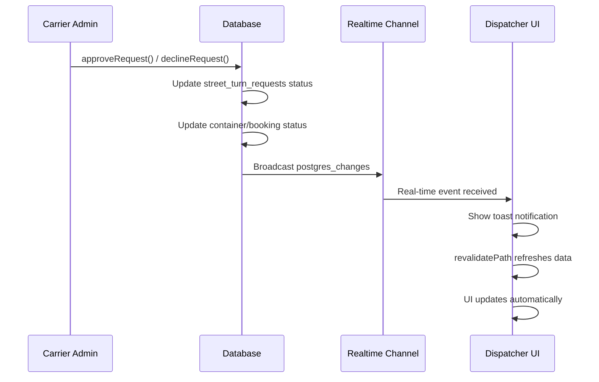

# Dispatcher Real-time Updates Implementation

## Tóm tắt
Đã triển khai thành công tính năng cập nhật real-time cho Dispatcher khi Carrier Admin thực hiện phê duyệt/từ chối yêu cầu street-turn.

## Các tính năng đã triển khai

### 1. Real-time Notifications 🔔
- **Toast notifications** xuất hiện ngay lập tức khi status thay đổi
- **Phê duyệt**: Toast màu xanh với thông tin container và booking
- **Từ chối**: Toast màu đỏ với lý do từ chối (nếu có)
- Auto-dismiss sau 5-7 giây

### 2. Automatic Data Refresh 🔄
- Server actions có `revalidatePath('/dispatcher')` 
- Data được reload tự động khi Dispatcher navigate/refresh
- KPI cards cập nhật số liệu real-time

### 3. Status Badge Updates 🏷️
- Container: `AWAITING_APPROVAL` → `CONFIRMED` (phê duyệt) hoặc `AVAILABLE` (từ chối)
- Booking: Tương tự container
- Gợi ý ghép nối xuất hiện lại khi bị từ chối

## Files đã tạo/sửa

### Components mới
1. **`src/components/features/dispatcher/DispatcherRealtimeUpdater.tsx`**
   - Lắng nghe Supabase real-time changes
   - Filter theo `requesting_org_id` của user
   - Hiển thị toast notifications

2. **`src/components/features/dispatcher/DispatcherDashboardWrapper.tsx`**
   - Client component wrapper
   - Tích hợp DispatcherRealtimeUpdater và Toaster

### UI Components
3. **`src/components/ui/toast.tsx`** - Toast component với Radix UI
4. **`src/components/ui/toaster.tsx`** - Toast provider/container
5. **`src/hooks/use-toast.ts`** - Toast state management hook

### Pages đã cập nhật
6. **`src/app/(main)/dispatcher/page.tsx`**
   - Wrapped với DispatcherDashboardWrapper
   - Truyền userOrgId cho real-time subscription

## Luồng hoạt động



## Technical Details

### Real-time Subscription
```typescript
// Lắng nghe chỉ những thay đổi của organization mình
filter: `requesting_org_id=eq.${userOrgId}`

// Chỉ hiển thị toast khi status thực sự thay đổi  
if (newStatus !== oldStatus) {
  // Show appropriate toast
}
```

### Toast Messages
- **Approved**: "🎉 Yêu cầu được phê duyệt! Street-turn cho container {number} → booking {number} đã được chấp thuận."
- **Declined**: "❌ Yêu cầu bị từ chối. Container {number} đã bị từ chối. Lý do: {reason}"

### Badge Color Scheme
- `AVAILABLE`: Badge xanh lá "Sẵn sàng"
- `AWAITING_APPROVAL`: Badge vàng "Chờ duyệt"  
- `CONFIRMED`: Badge xanh dương "Đã xác nhận"

## Testing Instructions

### Setup Test Environment
1. Mở 2 browser windows:
   - Window 1: Login as DISPATCHER
   - Window 2: Login as CARRIER_ADMIN

### Test Approval Flow
1. Dispatcher tạo street-turn request
2. Container/booking chuyển thành `AWAITING_APPROVAL`
3. Carrier Admin phê duyệt request
4. ✅ Dispatcher nhận toast xanh ngay lập tức
5. ✅ Badge chuyển thành `CONFIRMED`
6. ✅ KPI "Street-Turns Đã Duyệt" tăng +1

### Test Decline Flow  
1. Dispatcher tạo street-turn request
2. Carrier Admin từ chối với lý do
3. ✅ Dispatcher nhận toast đỏ với lý do
4. ✅ Badge quay về `AVAILABLE`
5. ✅ Gợi ý ghép nối xuất hiện lại

## Package Dependencies
- `@radix-ui/react-toast`: Toast UI components
- `react-hook-form`: Form validation (đã có)
- Supabase real-time subscriptions (đã có)

## Next Steps (Optional Enhancements)
1. 🔊 **Browser notifications** cho các tab không active
2. 📱 **Push notifications** qua service worker
3. 🔔 **In-app notification center** lưu trữ lịch sử thông báo
4. 🎵 **Sound notifications** cho các action quan trọng
5. 📊 **Real-time dashboard updates** không cần reload

## Cập nhật bổ sung (Phase 2)

### ✅ Tính năng mới đã thêm:

1. **🔄 router.refresh() Integration**
   - Thêm `router.refresh()` vào DispatcherRealtimeUpdater
   - Tự động reload Server Component data sau khi nhận real-time event
   - Đảm bảo UI luôn sync với database

2. **📋 Enhanced revalidatePath**
   - Thêm `revalidatePath('/dispatcher/requests')` vào server actions
   - Đảm bảo trang "Quản lý Yêu cầu" cũng được refresh

3. **🏷️ Improved Status Mapping**
   - Chuẩn hóa statusMap cho tất cả components:
     - ImportContainersTable: `CONFIRMED` → "Đã ghép" (variant: info)
     - ExportBookingsTable: `CONFIRMED` → "Đã ghép" (variant: info)
     - RequestHistoryTable: Giữ nguyên logic hiện tại

4. **📄 Real-time cho trang Requests**
   - Tích hợp DispatcherDashboardWrapper vào `/dispatcher/requests`
   - Toast notifications hoạt động trên cả 2 trang: Dashboard và Requests

### 🔧 Technical Improvements:

```typescript
// DispatcherRealtimeUpdater.tsx - Enhanced
router.refresh() // Reload Server Component data
```

```typescript
// Server Actions - Enhanced revalidatePath
revalidatePath('/carrier-admin')
revalidatePath('/dispatcher')
revalidatePath('/dispatcher/requests') // NEW
```

```typescript
// StatusMap - Standardized format
const statusMap = {
  'AVAILABLE': { text: 'Sẵn sàng', variant: 'approved' as const },
  'AWAITING_APPROVAL': { text: 'Chờ duyệt', variant: 'pending' as const },
  'CONFIRMED': { text: 'Đã ghép', variant: 'info' as const },
}
```

### 📱 User Experience Flow:

1. **Dispatcher gửi request** → Container/booking chuyển `AWAITING_APPROVAL`
2. **Carrier Admin phê duyệt** → Real-time toast + `router.refresh()` + status → `CONFIRMED` ("Đã ghép")
3. **Carrier Admin từ chối** → Real-time toast + `router.refresh()` + status → `AVAILABLE` + gợi ý xuất hiện lại

### 🎯 Coverage:
- ✅ Dashboard: Real-time notifications + auto refresh
- ✅ Requests page: Real-time notifications + auto refresh  
- ✅ KPI cards: Auto update
- ✅ Status badges: Consistent mapping
- ✅ Match suggestions: Auto reappear when declined

---
✅ **Implementation Complete** - Real-time system hoạt động toàn diện trên cả 2 trang! 